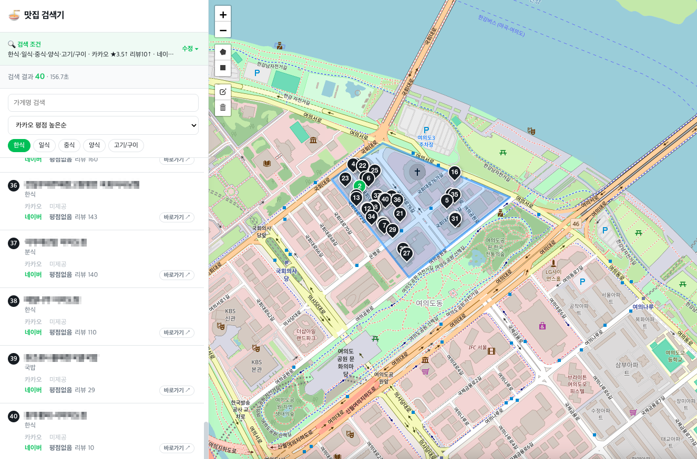

# 🍜 맛집 검색기 (matjip)

지도에서 영역을 직접 그리면, 그 안의 맛집을 **카카오·네이버에서 수집**해
카테고리·평점·리뷰 조건으로 걸러 **한 식당당 양쪽 평점을 함께** 보여주는
**로컬 실행용** 도구.



- 언어: Python (Flask)
- 지도/그리기: Leaflet + Leaflet.draw + OpenStreetMap (API 키 불필요)
- 수집: playwright (카카오맵 / 네이버지도)
- DB: 사용 안 함 (매번 실시간 수집), 설정은 `config/*.yaml`

## 주요 기능

- **지도에 다각형/사각형**을 그려 검색 영역 지정
- **카테고리**(한식·일식·중식·양식·치킨·고기·카페·술집…) 선택
- **소스별 평점/리뷰 필터** (카카오 별점, 네이버 별점·리뷰수, 미제공 포함 여부)
- 결과를 **식당 단위로 병합** — 한 줄에 `네이버 ★4.4(리뷰7) / 카카오 ★3.1(리뷰3)`, 없으면 "미제공"
- **결과 내 필터/정렬**(재검색 없이): 가게명 검색, 카테고리 좁히기, 정렬(가게명·평점·리뷰순)
- 수집 **진행률·소요시간** 표시
- 좌측 결과 카드 ↔ 지도 번호 핀 연동

## 동작 흐름

```
지도에서 다각형/사각형 → GeoJSON
  → bbox → 격자(grid) 타일 분할
  → 타일마다 카카오/네이버 검색 (네이버는 폴리곤 중심으로 localize)
  → 결과 좌표가 원래 다각형 안인지 판정(point-in-polygon)
  → 카카오는 상세에서 평점/리뷰 보강(병렬)
  → 카테고리·평점·리뷰 필터 → 소스 간 식당 병합 → 정렬 → 카드+마커
```

소스(카카오/네이버)는 임의의 다각형을 못 받으므로 **검색은 사각형/지역 단위,
필터링은 다각형 단위**로 해서 그린 모양 그대로 걸러냅니다.

## 설치

```bash
cd matjip
python3 -m venv .venv
source .venv/bin/activate
pip install -r requirements.txt
playwright install chromium

# 비밀 설정(카카오 키 등)은 gitignore 되는 로컬 파일에 둔다
cp config/settings.local.yaml.example config/settings.local.yaml
# → config/settings.local.yaml 을 열어 카카오 REST 키를 채운다
```

## 실행

```bash
./run.sh      # 서버 시작 → http://127.0.0.1:5001
./stop.sh     # 종료
```

- `run.sh` 는 venv·의존성이 없으면 자동 설치하고 백그라운드로 서버를 띄웁니다.
- 로그: `tail -f server.log`
- 직접 실행하려면 `python -m app.server` 도 됩니다.

## 사용법

1. 지도 우측 상단 도구로 **사각형/다각형** 그리기
2. 좌측에서 **카테고리** 선택
3. **평점·리뷰 필터**, **수집 개수** 조정 → **맛집 검색**
4. 검색 중 진행률이 표시되고, 끝나면 좌측에 결과 카드 + 지도 핀
5. 결과 상단에서 **가게명 검색·카테고리 좁히기·정렬** (재검색 없이 즉시)

## 설정 파일

### `config/settings.yaml`
- `server.port` : 기본 5001 (macOS AirPlay 가 5000 을 써서 회피)
- `sources` : 카카오/네이버 on/off
- `collection.default_limit` / `hard_cap` : 개수 기본값 / "모두 가져오기" 상한
- `grid.tile_size_m` / `max_tiles` : 격자 촘촘함 / 최대 타일 수
- `scrape.headless` : **true = 창 없이 실행(권장)**, false = 크롬 창 표시(디버그)
- `scrape.enrich_concurrency` : 카카오 평점 보강 동시 요청 수 (기본 8)
- `scrape.mock: true` : 네트워크·키 없이 가짜 데이터로 UI 전체 흐름 테스트
- `kakao.rest_api_key` : (실제 키는 `settings.local.yaml` 에)

### `config/filters.yaml`
- `categories` : 카테고리별 `terms`(검색어) / `match`(결과 카테고리 판정 키워드)
- `rating` : 소스별 기본 최소 평점 / 최소 리뷰수 / 미제공 포함 여부

## 실제 수집 관련 참고

- **네이버**: `pcmap.place.naver.com/restaurant/list` 를 크롬 **new headless**(창 없음)로
  열고, 목록의 **안쪽 스크롤 컨테이너**를 스크롤해 항목을 로드한 뒤 페이지의
  `window.__APOLLO_STATE__` 를 파싱합니다. 별점·리뷰수·좌표를 얻습니다.
  - 구 헤드리스(`--headless`)는 봇으로 차단(405)되므로 **new headless** 를 씁니다.
  - anti-bot 이 **rate 기반**이라 짧은 시간에 과도하게 검색하면 일시 차단됩니다.
    막히면 잠시 후 재시도. 쿠키는 `.browser_profile/` 에 유지됩니다.
- **카카오**: 목록은 `dapi.kakao.com` 키워드+rect 검색(REST 키), 평점/리뷰는
  `place-api.map.kakao.com/places/panel3/{id}` 에서 병렬 보강합니다.
  - ⚠️ 키가 있어도 **해당 앱에 '카카오맵' 서비스가 켜져 있어야** 합니다(없으면 403).
    developers.kakao.com → 내 앱 → 제품 설정에서 카카오맵 활성화.
  - 리뷰수는 **카카오맵 '후기' 수만** 사용합니다(블로그 리뷰는 평점이 없어 제외).
- 소스 응답 구조는 바뀔 수 있습니다. 필드가 안 맞으면
  `app/scrapers/kakao.py`, `app/scrapers/naver.py` 의 파싱부만 조정하면 됩니다.

## 처음이라면

`settings.yaml` 에서 `scrape.mock: true` 로 켜고 실행하면 네트워크·키 없이
가짜 맛집으로 UI·필터·병합 전 흐름을 체험할 수 있습니다. 확인 후 `false` 로
되돌리고 실제 키를 넣으세요.
